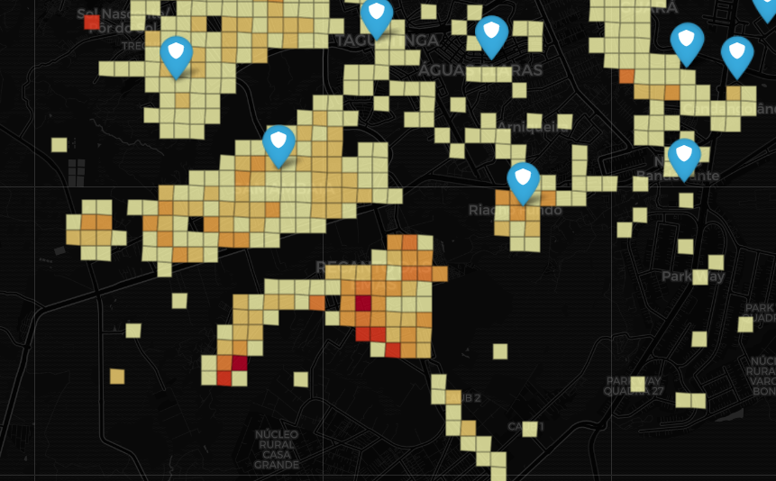
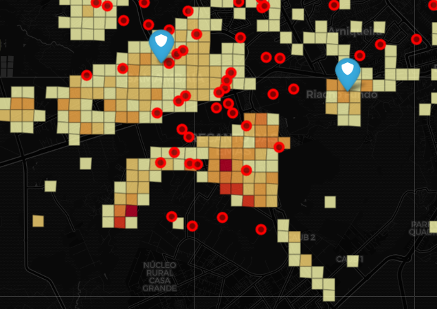

{fig-align="center"}

\newpage

# Sumário Executivo

-   Visão geral
-   Diferentes tipos de violência
-   Fatores associados
-   Alcoolismo?
-   Descumprimento de medida protetiva
-   Casos de reincidência
-   Insights

# Introdução

Este relatório consolida os insights extraídos a partir da base de ocorrências da Lei Maria da Penha registrados pela PMDF em 2025. O objetivo desta análise é identificar padrões e contextos

# Visão Geral

Essa análise leva em consideração 12.123 ocorrências associadas à Lei Maria da Penha. Os dados são referentes ao ano de 2024

**De maneira geral, as ocorrências estão bem distribuídas ao longo dos meses, o que sugere que datas comemorativas não são um fator determinante para que a violência aconteça**

```{python}
from utils.report_theme import set_report_theme
from utils.report_plots import *
import pandas as pd
import numpy as np
import matplotlib.pyplot as plt
import seaborn as sns

# TEMA GLOBAL DO RELATÓRIO ANALÍTICO
import matplotlib.pyplot as plt
import seaborn as sns
COLORS = set_report_theme()

df = pd.read_csv('../data/base_analisada.csv', sep=None, engine='python', encoding='utf-8')
```

```{python}
# PREPARAÇÃO DOS DADOS
df_ocorrencias = df.copy()

# cria coluna Ano-Mês usando campos já existentes
df_ocorrencias["ano_mes"] = (
    df_ocorrencias["ano"].astype(str)
    + "-"
    + df_ocorrencias["mes"].astype(str).str.zfill(2)
)

# AGREGAÇÃO
df_plot = (
    df_ocorrencias
    .groupby("ano_mes")
    .size()
    .reset_index(name="quantidade")
    .sort_values("ano_mes")
)

# PLOT PADRONIZADO
bar_timeseries(
    df=df_plot,
    x="ano_mes",
    y="quantidade",
    title="Ocorrências registradas por mês",
    COLORS=COLORS, 
    xlabel = "Ano-Mês"
)
```

**Por outro lado, observa-se que, em relação aos dias da semana, 39.5% das ocorrências foram registradas durante o final de semana. Um possível motivo para é o maior tempo de convívio familiar nesses dias**

```{python}
# PREPARAÇÃO DOS DADOS
df_semana = df.copy()

# cria coluna datetime apenas para cálculo
# cria coluna datetime apenas para cálculo
df_semana["data"] = pd.to_datetime(
    dict(
        year=df_semana["ano"],
        month=df_semana["mes"],
        day=df_semana["dia"]
    ),
    errors="coerce"
)

# nomes dos dias em português
dias_semana = {
    0: "Segunda-feira",
    1: "Terça-feira",
    2: "Quarta-feira",
    3: "Quinta-feira",
    4: "Sexta-feira",
    5: "Sábado",
    6: "Domingo"
}

df_semana["dia_semana"] = (
    df_semana["data"]
    .dt.weekday
    .map(dias_semana)
)


# AGREGAÇÃO
df_plot = (
    df_semana
    .groupby("dia_semana")
    .size()
    .reset_index(name="quantidade")
)

# ordem lógica dos dias
ordem_dias = list(dias_semana.values())

df_plot["dia_semana"] = pd.Categorical(
    df_plot["dia_semana"],
    categories=ordem_dias,
    ordered=True
)

df_plot = df_plot.sort_values("dia_semana")

# PLOT PADRONIZADO
bar_vertical_temporal_highlight(
    df=df_plot,
    x="dia_semana",
    y="quantidade",
    title="Ocorrências por dia da semana",
    COLORS=COLORS, 
    xlabel = "Dia da Semana"
)
```

**Nessa esteira, o horário das ocorrências também corresponde ao provável período de convívio entre a vítima e o agressor. As ocorrências durante a madrugada também estão associadas ao consumo de álcool**

```{python}
# PREPARAÇÃO DOS DADOS
df_hora = df.copy()

# garante tipo numérico
df_hora["hora"] = pd.to_numeric(df_hora["hora"], errors="coerce")

df_hora = df_hora.dropna(subset=["hora"])

# AGREGAÇÃO
df_plot = (
    df_hora
    .groupby("hora")
    .size()
    .reset_index(name="quantidade")
    .sort_values("hora")
)

horas_completas = pd.DataFrame({"hora": range(24)})

df_plot = (
    horas_completas
    .merge(df_plot, on="hora", how="left")
    .fillna(0)
)

df_plot["quantidade"] = df_plot["quantidade"].astype(int)

# PLOT PADRONIZADO

line_chart(
    df=df_plot,
    x="hora",
    y="quantidade",
    title="Ocorrências por hora do dia",
    COLORS=COLORS, 
    xlabel="Hora do dia"
)
```

# Tipos de violência

A violência contra a mulher pode ser classificada em 5 diferentes tipos:

-   Física
-   Psicológica
-   Moral
-   Sexual
-   Patrimonial

**Nas ocorrências analisadas, observa-se que mais de 70% dos casos envolvem violência física ou pastrimonial**

Isso não significa que as outras categorias sejam menos frequentes, mas que podem ser subnotificadas (Provavelmente uma mulher não vai chamar a Polícia Militar devido a uma violência exclusivamente psicológica)

```{python}

# PREPARAÇÃO DOS DADOS
df_violencia = df.copy()

cols_violencia = [
    "v_fisica",
    "v_psicologica",
    "v_patrimonial",
    "v_sexual",
    "v_moral"
]

# AGREGAÇÃO
df_plot = (
    df_violencia[cols_violencia]
    .sum()
    .reset_index()
)

df_plot.columns = ["tipo_violencia", "quantidade"]

# nomes amigáveis para relatório
map_labels = {
    "v_fisica": "Violência Física",
    "v_psicologica": "Violência Psicológica",
    "v_patrimonial": "Violência Patrimonial",
    "v_sexual": "Violência Sexual",
    "v_moral": "Violência Moral"
}

df_plot["tipo_violencia"] = df_plot["tipo_violencia"].map(map_labels)

# PLOT PADRONIZADO
bar_horizontal_highlight(
    df=df_plot,
    x="tipo_violencia",
    y="quantidade",
    title="Tipos de violência mais frequentes nas ocorrências",
    COLORS=COLORS, 
    ylabel = "Tipo de violência"
)
```

Além disso, é possível e muito provável que haja coocorrências de diferentes tipos de violência no mesmo caso

```{python}

```

# Fatores Associados

**Mais de 30% das ocorrências estão associadas a algum fator externo como consumo de álcool ou drogas, descumprimento de medida protetiva ou término recente de relacionamento.**

**Consumo de álcool ou descumprimento de medida protetiva são fatores presentes em cerca de 23% das ocorrências analisadas**

```{python}
def bar_horizontal_highlight(
    df,
    x,
    y,
    title,
    COLORS
):

    from matplotlib.ticker import FuncFormatter

    df_plot = df.sort_values(y, ascending=True)

    colors = _highlight_colors(df_plot[y].values, COLORS)

    plt.figure(figsize=(8, 5))

    ax = plt.barh(
        df_plot[x],
        df_plot[y],
        color=colors
    )

    plt.yticks(rotation=0)
    plt.xticks(rotation=0)

    _setup_axes(title, xlabel=y, ylabel=x)

    # formata eixo em percentual brasileiro
    plt.gca().xaxis.set_major_formatter(
        FuncFormatter(lambda x, _: f"{x:.1f}%".replace(".", ","))
    )

    # labels nas barras já formatados
    for container in plt.gca().containers:
        labels = [
            f"{v.get_width():.1f}%".replace(".", ",")
            for v in container
        ]
        plt.bar_label(container, labels=labels, padding=3)

    plt.tight_layout()
    plt.show()
```

# Consumo de álcool

Este é o fator associado mais representativo dentre os dados analisados. Cerca de 12% das ocorrências estão relacionadas ao consumo de álcool

**Observa-se que há uma tendência à linearidade quanto ao total de casos registrados por dia da semana** Isso sugere que ocorrências nesse contexto não estão restritas a datas comemorativas ou finais de semana. Pelo contrário, a ausência de sazonalidade indica que o consumo de álcool por parte dos agressores é constante

```{python}
# ÁLCOOL — POR DIA DA SEMANA
df_alcool = df.copy()

# filtra apenas casos com álcool
df_alcool = df_alcool[df_alcool["flag_alcool"] == True]

# cria datetime
df_alcool["data"] = pd.to_datetime(
    dict(
        year=df_alcool["ano"],
        month=df_alcool["mes"],
        day=df_alcool["dia"]
    ),
    errors="coerce"
)

dias_semana = {
    0: "Segunda-feira",
    1: "Terça-feira",
    2: "Quarta-feira",
    3: "Quinta-feira",
    4: "Sexta-feira",
    5: "Sábado",
    6: "Domingo"
}

df_alcool["dia_semana"] = (
    df_alcool["data"].dt.weekday.map(dias_semana)
)

df_plot_semana = (
    df_alcool
    .groupby("dia_semana")
    .size()
    .reset_index(name="quantidade")
)

ordem = list(dias_semana.values())

df_plot_semana["dia_semana"] = pd.Categorical(
    df_plot_semana["dia_semana"],
    categories=ordem,
    ordered=True
)

df_plot_semana = df_plot_semana.sort_values("dia_semana")

bar_vertical_temporal_highlight(
    df=df_plot_semana,
    x="dia_semana",
    y="quantidade",
    title="Ocorrências com consumo de álcool por dia da semana",
    COLORS=COLORS
)

# ======================================
# ÁLCOOL — POR MÊS
meses = {
    1: "Janeiro",
    2: "Fevereiro",
    3: "Março",
    4: "Abril",
    5: "Maio",
    6: "Junho",
    7: "Julho",
    8: "Agosto",
    9: "Setembro",
    10: "Outubro",
    11: "Novembro",
    12: "Dezembro"
}

df_plot_mes = (
    df_alcool
    .groupby("mes")
    .size()
    .reset_index(name="quantidade")
)

df_plot_mes["mes_nome"] = df_plot_mes["mes"].map(meses)

df_plot_mes = df_plot_mes.sort_values("mes")

bar_timeseries(
    df=df_plot_mes,
    x="mes_nome",
    y="quantidade",
    title="Ocorrências com consumo de álcool por mês",
    COLORS=COLORS, 
    xlabel = "Mês"
)
```

**Por outro lado, as ocorrências tendem a aumentar conforme a noite e a madrugada chegam**

```{python}
# ÁLCOOL — POR HORA DO DIA

df_plot_hora = (
    df_alcool
    .groupby("hora")
    .size()
    .reset_index(name="quantidade")
    .sort_values("hora")
)

line_chart(
    df=df_plot_hora,
    x="hora",
    y="quantidade",
    title="Ocorrências com consumo de álcool por hora do dia",
    COLORS=COLORS, 
    xlabel = "Hora do dia"
)
```

# Descumprimento de medida protetiva

Este é o segundo fator mais relevante nos dados analisados. Cerca de 11% das ocorrências envolviam o descumprimento de medida protetiva

**Os descumprimentos de medida protetiva também ocorrerem, em sua maioria, aos fins de semana**

```{python}
# MEDIDA PROTETIVA — POR DIA DA SEMANA
df_medida_protetiva = df.copy()

# filtra apenas casos com medida protetiva ativa
df_medida_protetiva = df_medida_protetiva[df_medida_protetiva["flag_medida_protetiva"] == True]

# cria datetime
df_medida_protetiva["data"] = pd.to_datetime(
    dict(
        year=df_medida_protetiva["ano"],
        month=df_medida_protetiva["mes"],
        day=df_medida_protetiva["dia"]
    ),
    errors="coerce"
)

dias_semana = {
    0: "Segunda-feira",
    1: "Terça-feira",
    2: "Quarta-feira",
    3: "Quinta-feira",
    4: "Sexta-feira",
    5: "Sábado",
    6: "Domingo"
}

df_medida_protetiva["dia_semana"] = (
    df_medida_protetiva["data"].dt.weekday.map(dias_semana)
)

df_plot_semana = (
    df_medida_protetiva
    .groupby("dia_semana")
    .size()
    .reset_index(name="quantidade")
)

ordem = list(dias_semana.values())

df_plot_semana["dia_semana"] = pd.Categorical(
    df_plot_semana["dia_semana"],
    categories=ordem,
    ordered=True
)

df_plot_semana = df_plot_semana.sort_values("dia_semana")

bar_vertical_temporal_highlight(
    df=df_plot_semana,
    x="dia_semana",
    y="quantidade",
    title="Ocorrências com descumprimento de medida protetiva por dia da semana",
    COLORS=COLORS,
    xlabel = "Dia da semana"
)

# ======================================
# MEDIDA PROTETIVA — POR MÊS
meses = {
    1: "Janeiro",
    2: "Fevereiro",
    3: "Março",
    4: "Abril",
    5: "Maio",
    6: "Junho",
    7: "Julho",
    8: "Agosto",
    9: "Setembro",
    10: "Outubro",
    11: "Novembro",
    12: "Dezembro"
}

df_plot_mes = (
    df_medida_protetiva
    .groupby("mes")
    .size()
    .reset_index(name="quantidade")
)

df_plot_mes["mes_nome"] = df_plot_mes["mes"].map(meses)

df_plot_mes = df_plot_mes.sort_values("mes")

bar_timeseries(
    df=df_plot_mes,
    x="mes_nome",
    y="quantidade",
    title="Ocorrências com descumprimento de medida protetiva por mês",
    COLORS=COLORS, 
    xlabel = "Mês"
)
```

**Além disso, o horário comercial também ganha destaque devido à quantidade de ocorrências registradas nesse período**

```{python}
# MEDIDA PROTETIVA — POR HORA DO DIA

df_plot_hora = (
    df_medida_protetiva
    .groupby("hora")
    .size()
    .reset_index(name="quantidade")
    .sort_values("hora")
)

line_chart(
    df=df_plot_hora,
    x="hora",
    y="quantidade",
    title="Ocorrências com descumprimento de medida protetiva por hora do dia",
    COLORS=COLORS
)
```

**Por outro lado, observa-se que a participação desse fator dentro do total de ocorrências diárias se comporta de maneira inversa à do consumo alcoólico**

```{python}
# ==============================
# PREPARAÇÃO
# ==============================

df_semana = df.copy()
# cria data válida
df_semana["data"] = pd.to_datetime(
    dict(
        year=df_semana["ano"],
        month=df_semana["mes"],
        day=df_semana["dia"]
    ),
    errors="coerce"
)

# ==============================
# DIA DA SEMANA (PT-BR)
# ==============================

dias_semana = {
    0: "Segunda-feira",
    1: "Terça-feira",
    2: "Quarta-feira",
    3: "Quinta-feira",
    4: "Sexta-feira",
    5: "Sábado",
    6: "Domingo"
}

df_semana["dia_semana"] = (
    df_semana["data"]
    .dt.weekday
    .map(dias_semana)
)

# ==============================
# CÁLCULO DO PERCENTUAL
# ==============================

df_plot = (
    df_semana
    .groupby("dia_semana")["flag_alcool"]
    .mean()                # ← proporção
    .mul(100)              # ← percentual
    .reset_index(name="percentual")
)

# ordem lógica dos dias
ordem_dias = list(dias_semana.values())

df_plot["dia_semana"] = pd.Categorical(
    df_plot["dia_semana"],
    categories=ordem_dias,
    ordered=True
)

df_plot = df_plot.sort_values("dia_semana")

# ==============================
# PLOT
# ==============================

bar_vertical_temporal_highlight(
    df=df_plot,
    x="dia_semana",
    y="percentual",
    title="Percentual de ocorrências com consumo de álcool por dia da semana",
    COLORS=COLORS,
    xlabel = "Dia da semana"
)

# ==============================
# PREPARAÇÃO
# ==============================

df_semana = df.copy()

# cria data válida
df_semana["data"] = pd.to_datetime(
    dict(
        year=df_semana["ano"],
        month=df_semana["mes"],
        day=df_semana["dia"]
    ),
    errors="coerce"
)

dias_semana = {
    0: "Segunda-feira",
    1: "Terça-feira",
    2: "Quarta-feira",
    3: "Quinta-feira",
    4: "Sexta-feira",
    5: "Sábado",
    6: "Domingo"
}

df_semana["dia_semana"] = (
    df_semana["data"]
    .dt.weekday
    .map(dias_semana)
)

df_plot = (
    df_semana
    .groupby("dia_semana")["flag_medida_protetiva"]
    .mean()                # ← proporção
    .mul(100)              # ← percentual
    .reset_index(name="percentual")
)

# ordem lógica dos dias
ordem_dias = list(dias_semana.values())

df_plot["dia_semana"] = pd.Categorical(
    df_plot["dia_semana"],
    categories=ordem_dias,
    ordered=True
)

df_plot = df_plot.sort_values("dia_semana")

# PLOT

bar_vertical_temporal_highlight(
    df=df_plot,
    x="dia_semana",
    y="percentual",
    title="Percentual de ocorrências com descumprimento de medida protetiva por dia da semana",
    COLORS=COLORS, 
    xlabel = "Dia da semana"
)
```

# Reincidência e Ciclo de Violência

A análise de reincidência é o termômetro do **"enxugamento de gelo"** no policiamento ostensivo. Para contornar a imprecisão natural dos aparelhos de GPS das viaturas (que podem variar alguns metros), a clusterização não foi feita por coordenadas, mas sim por meio de **engenharia de texto** cruzando a Quadra e o Complemento (ex: "QNN 06 CASA 31").

**Os dados revelam uma realidade alarmante: centenas de lares acionaram o 190 repetidas vezes em um curto espaço de tempo, indicando falhas na rede de proteção contínua.**

## Análise de Reincidência por Endereço

```{python}
#| label: fig-reincidencia
#| fig-cap: "Volume de Endereços por Frequência de Reincidência da PMDF"
#| fig-align: center

from utils.report_plots import bar_horizontal_highlight

# PREPARAÇÃO DOS DADOS: REINCIDÊNCIA
df_reincidencia = df.copy()

# Recriando a coluna de endereço (pois ela havia sido descartada para limpar o CSV)
df_reincidencia['COMPLEMENTO_CLEAN'] = df_reincidencia['complemento'].fillna('').str.upper()
df_reincidencia['QUADRA_CLEAN'] = df_reincidencia['quadra'].fillna('').str.upper()
df_reincidencia['ENDERECO_BUSCA'] = df_reincidencia['cidade'].fillna('').str.upper() + " " + df_reincidencia['QUADRA_CLEAN'] + " " + df_reincidencia['COMPLEMENTO_CLEAN']

# Focamos em residências
df_casas = df_reincidencia[df_reincidencia['TIPO_MORADIA'].isin(['CASA', 'APARTAMENTO'])]

# 1. Conta quantos chamados teve CADA endereço único
contagem_por_endereco = df_casas['ENDERECO_BUSCA'].value_counts()

# 2. Filtra apenas os reincidentes (que ligaram mais de 1 vez)
enderecos_reincidentes = contagem_por_endereco[contagem_por_endereco > 1]

# 3. Conta QUANTAS CASAS tiveram X chamados
distribuicao_reincidencia = (
    enderecos_reincidentes
    .value_counts()
    .rename_axis('Qtd_Chamados_no_Mesmo_Endereco') # Nomeia a coluna do eixo X
    .reset_index(name='Total_de_Enderecos')        # Nomeia a coluna do eixo Y
)

distribuicao_reincidencia = distribuicao_reincidencia.sort_values('Qtd_Chamados_no_Mesmo_Endereco')

# Trocando para string para o gráfico de barras ficar categórico
distribuicao_reincidencia['Qtd_Chamados_no_Mesmo_Endereco'] = distribuicao_reincidencia['Qtd_Chamados_no_Mesmo_Endereco'].astype(str) + " Chamados"

# PLOT (Usando a identidade visual oficial do grupo)
bar_horizontal_highlight(
    df=distribuicao_reincidencia.tail(5), # Pegando os top 5 níveis de reincidência
    x="Qtd_Chamados_no_Mesmo_Endereco",
    y="Total_de_Enderecos",
    title="Volume de Endereços por Frequência de Reincidência da PMDF",
    COLORS=COLORS,
    xlabel="Total de Endereços",
    ylabel="Frequência"
)
```

> **Nota Analítica**: Identificamos mais de 400 lares no Distrito Federal que exigiram múltiplas intervenções policiais no mesmo ano. A simples ocorrência de um segundo chamado (que representa a esmagadora maioria dos casos) já evidencia falhas na rede de proteção contínua. Estes locais demandam encaminhamento ativo e urgente para o **PROVID** (Prevenção Orientada à Violência Doméstica), pois a probabilidade de um desfecho fatal escala drasticamente a cada nova viatura acionada.

## Análise Geoespacial: O Vácuo de Policiamento

Para responder à pergunta **"O policiamento está onde o crime acontece?"**, o território do Distrito Federal foi clusterizado em uma grade espacial de **500x500 metros**. Isso permitiu a criação de um mapa de calor preciso de chamados 190.

Ao sobrepor as localizações exatas dos Batalhões da PMDF (representados como escudos azuis) à nossa grade de risco, identificamos **"Pontos Cegos"**. São áreas de densidade demográfica elevada com alta incidência criminal, mas que estão geograficamente distantes da base de prontidão mais próxima.

{fig-align="center"}

## A Ponta do Iceberg: O Cruzamento com Feminicídios

O trabalho ostensivo da PMDF (Chamados 190) lida com a prevenção e o flagrante. O desfecho fatal, no entanto, é investigado pela Polícia Civil (PCDF).

Para validar a eficácia da nossa clusterização de risco, cruzamos as ocorrências da **Lei Maria da Penha** (PMDF) com dados oficiais de **230 feminicídios consumados** mapeados pela SSP-DF.

**O insight mais grave do projeto**: Os casos de feminicídio (bolhas vermelhas) ocorrem majoritariamente nas mesmas áreas geográficas (RAs e quadrantes) que o nosso algoritmo já havia classificado como de alto risco com base nos chamados rotineiros do 190.

Isso valida empiricamente a nossa tese preditiva: **a mancha de chamados emergenciais "antecipa" a mancha do feminicídio**.

{fig-align="center"}

# Conclusões e Próximos Passos

## Achados Principais

-   **A violência tem horário e local**: A agressão em contexto doméstico explode em períodos de recolhimento (noite/madrugada e finais de semana), sendo fortemente agravada pelo álcool.
-   **A ineficácia do patrulhamento reativo**: A alta reincidência em endereços fixos demonstra que o mero despacho de viaturas após o crime não rompe o ciclo da violência.
-   **Prova de Conceito (PoC) Concluída**: A estruturação desta base (enriquecida com NLP e dados geoespaciais) está pronta para o treinamento de modelos de Machine Learning.

## Roadmap ML

Se alimentados com a base histórica completa (últimos 5 anos), os algoritmos poderão prever estatisticamente em quais quadrantes (Células de 500m) ocorrerão os próximos crimes no turno subsequente, permitindo à PMDF migrar de um modelo de patrulhamento de ronda para um **policiamento preditivo de altíssima precisão**.